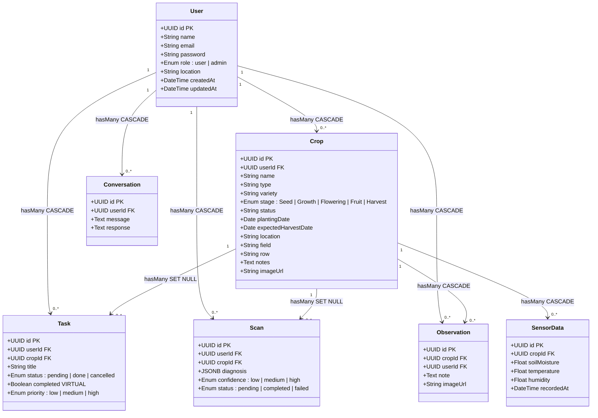

```mermaid
classDiagram
    direction TB

    class User {
        +UUID      id  PK
        +String    name
        +String    email
        +String    password
        +Enum      role : user | admin
        +String    location
        +DateTime  createdAt
        +DateTime  updatedAt
    }

    class Crop {
        +UUID      id  PK
        +UUID      userId  FK
        +String    name
        +String    type
        +String    variety
        +Enum      stage : Seed | Growth | Flowering | Fruit | Harvest
        +String    status
        +Date      plantingDate
        +Date      expectedHarvestDate
        +String    location
        +String    field
        +String    row
        +Text      notes
        +String    imageUrl
    }

    class Task {
        +UUID      id  PK
        +UUID      userId  FK
        +UUID      cropId  FK
        +String    title
        +Enum      status : pending | done | cancelled
        +Boolean   completed  VIRTUAL
        +Enum      priority : low | medium | high
    }

    class Scan {
        +UUID      id  PK
        +UUID      userId  FK
        +UUID      cropId  FK
        +JSONB     diagnosis
        +Enum      confidence : low | medium | high
        +Enum      status : pending | completed | failed
    }

    class Observation {
        +UUID      id  PK
        +UUID      cropId  FK
        +UUID      userId  FK
        +Text      note
        +String    imageUrl
    }

    class SensorData {
        +UUID      id  PK
        +UUID      cropId  FK
        +Float     soilMoisture
        +Float     temperature
        +Float     humidity
        +DateTime  recordedAt
    }

    class Conversation {
        +UUID      id  PK
        +UUID      userId  FK
        +Text      message
        +Text      response
    }

    User "1" --> "0..*" Crop         : hasMany CASCADE
    User "1" --> "0..*" Task         : hasMany CASCADE
    User "1" --> "0..*" Scan         : hasMany CASCADE
    User "1" --> "0..*" Observation  : hasMany CASCADE
    User "1" --> "0..*" Conversation : hasMany CASCADE
    Crop "1" --> "0..*" Task         : hasMany SET NULL
    Crop "1" --> "0..*" Scan         : hasMany SET NULL
    Crop "1" --> "0..*" Observation  : hasMany CASCADE
    Crop "1" --> "0..*" SensorData   : hasMany CASCADE
```
